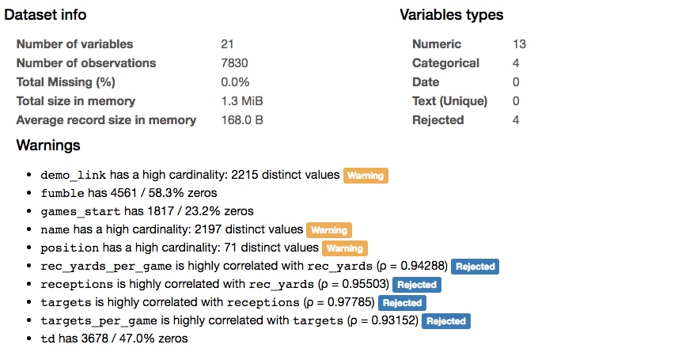

nfl
==============================

Examining NFL Wide Receivers.

Project Organization
------------

    ├── LICENSE
    ├── README.md          <- The top-level README for developers using this project.
    ├── data
    │   ├── external       <- Data from third party sources.
    │   ├── interim        <- Intermediate data that has been transformed.
    │   ├── processed      <- The final, canonical data sets for modeling.
    │   └── raw            <- The original, immutable data dump.
    │
    ├── models             <- Trained and serialized models, model predictions, or model summaries
    │
    ├── notebooks          <- Jupyter notebooks. Naming convention is a number (for ordering),
    │                         the creator's initials, and a short `-` delimited description, e.g.
    │                         `1.0-jqp-initial-data-exploration`.
    │
    ├── references         <- Data dictionaries, manuals, and all other explanatory materials.
    │
    ├── reports            <- Generated analysis as HTML, PDF, LaTeX, etc.
    │   └── figures        <- Generated graphics and figures to be used in reporting
    │
    │
    └── src                <- Source code for use in this project.
        ├── __init__.py    <- Makes src a Python module
        │
        ├── data           <- Scripts to download or generate data
        │   └── make_dataset.py
        │
        ├── features       <- Scripts to turn raw data into features for modeling
        │   └── build_features.py
        │
        ├── models         <- Scripts to train models and then use trained models to make
        │   │                 predictions
        │   ├── predict_model.py
        │   └── train_model.py
        │
        └── visualization  <- Scripts to create exploratory and results oriented visualizations
            └── visualize.py

--------

# Project Walkthrough

## Prompt

The purpose of this project is to explore wide receivers in the National Football League (NFL). The project showcases exploratory analysis, inferential analysis and regression modeling. The main questions we want to examine are whether taller wide recievers are better and if we can predict the average yards per reception based on other estimated statistics.

## Getting Data

The source data for the project was scraped from [Pro Football Reference](https://www.pro-football-reference.com/years). This site plus the network of sites it belongs to are incredibly easy to scrape and navigate. I obtained data from the 2000 season up through the current 2017 season.

## Cleaning Data

With web scraping, the data obtained is all in string format. Several columns were easily converted to integer and float values. Others needed to use string manipulation techniques in order to remove extra characters like percentage signs or unit names (ie. lb). There were only 3 players with missing weight/height data, another 4 with missing targets data and another 22 with missing age data. I dropped those with missing weight/height for now. The others will have to be dropped during other parts of the analysis.

The pandas profiling package gave useful insights on the various features. I will have to decide on a certain set of filters for modeling, such as to only examine players who are true wide receiver position players vs. running backs or tight ends that get many targets or to only examine players with a minimum threshold of targets per game.

## Exploratory Data Analysis

Highlight histograms, boxplots, others. Show outlier analysis like descriptive stats notebook about NBA players.

## Inferential Analysis

## Regression Analysis

## Conclusions

## Further Analysis
