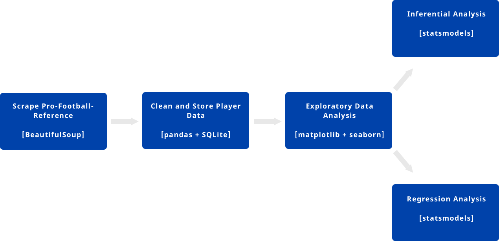
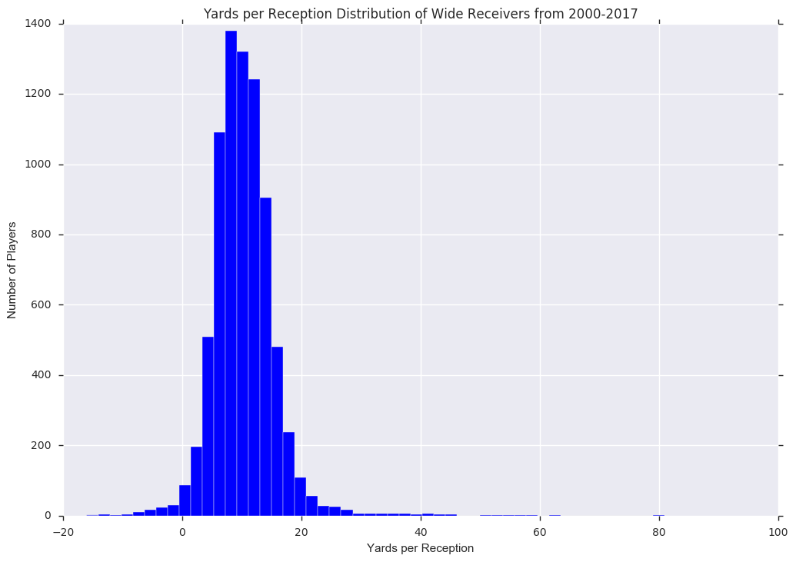
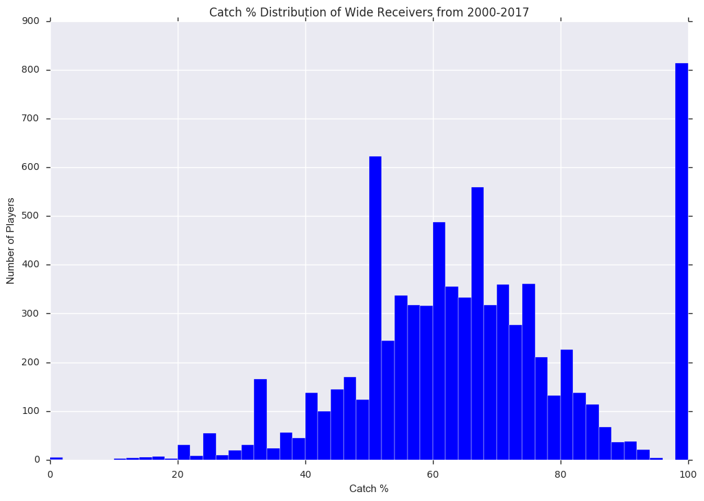
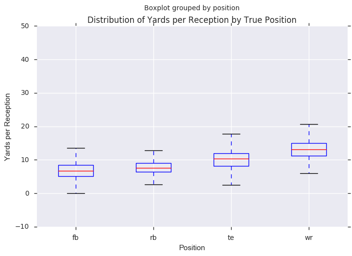
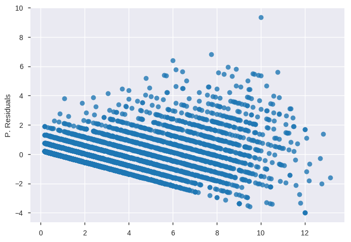
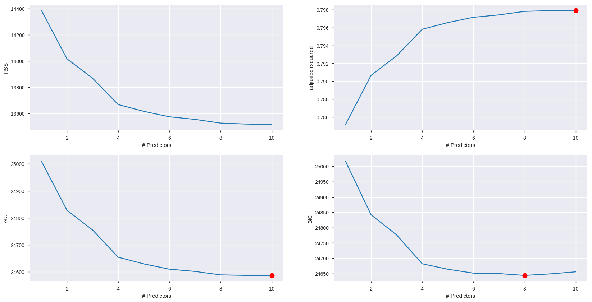

nfl
==============================

Examining NFL Wide Receivers.

Project Organization
------------

    ├── LICENSE
    ├── README.md          <- The top-level README for developers using this project.
    ├── data
    │   ├── external       <- Data from third party sources.
    │   ├── interim        <- Intermediate data that has been transformed.
    │   ├── processed      <- The final, canonical data sets for modeling.
    │   └── raw            <- The original, immutable data dump.
    │
    ├── models             <- Trained and serialized models, model predictions, or model summaries
    │
    ├── notebooks          <- Jupyter notebooks. Naming convention is a number (for ordering),
    │                         the creator's initials, and a short `-` delimited description, e.g.
    │                         `1.0-jqp-initial-data-exploration`.
    │
    ├── references         <- Data dictionaries, manuals, and all other explanatory materials.
    │
    ├── reports            <- Generated analysis as HTML, PDF, LaTeX, etc.
    │   └── figures        <- Generated graphics and figures to be used in reporting
    │
    │
    └── src                <- Source code for use in this project.
        ├── __init__.py    <- Makes src a Python module
        │
        ├── data           <- Scripts to download or generate data
        │   └── make_dataset.py
        │
        ├── features       <- Scripts to turn raw data into features for modeling
        │   └── build_features.py
        │
        ├── models         <- Scripts to train models and then use trained models to make
        │   │                 predictions
        │   ├── predict_model.py
        │   └── train_model.py
        │
        └── visualization  <- Scripts to create exploratory and results oriented visualizations
            └── visualize.py

--------
# Project Workflow

--------

# Project Walkthrough

## Prompt

The purpose of this project is to explore wide receivers in the National Football League (NFL). The project showcases exploratory analysis, inferential analysis and regression modeling. The main questions we want to examine are whether taller wide recievers are better and if we can predict the average yards per reception based on other estimated statistics.

## Getting Data

The source data for the project was scraped from [Pro Football Reference](https://www.pro-football-reference.com/years). This site plus the network of sites it belongs to are incredibly easy to scrape and navigate. I obtained data from the 2000 season up through the current 2017 season.

## Cleaning Data

With web scraping, the data obtained is all in string format. Several columns were easily converted to integer and float values. Others needed to use string manipulation techniques in order to remove extra characters like percentage signs or unit names (ie. lb). There were only 3 players with missing weight/height data, another 4 with missing targets data and another 22 with missing age data. I dropped those with missing weight/height for now. The others will have to be dropped during other parts of the analysis.

The pandas profiling package gave useful insights on the various features. I will have to decide on a certain set of filters for modeling, such as to only examine players who are true wide receiver position players vs. running backs or tight ends that get many targets or to only examine players with a minimum threshold of targets per game. There are quite a few highly correlated variables that may distort a future regression model. There are also a few features with quite a few zeroes and too many distinct positions.

## Exploratory Data Analysis

I started by examining the distributions of all the numerical features. Yards per reception will be the target variable for regression analysis. It has quite a high kurtosis value and that is evident by the extreme peakedness on the histogram.

The data needs a round of outlier removal as there seems to be players that have high catch percentages. These cases are probably players that had very few catches throughout the whole season.

From the earlier analysis, I noticed there are 72 distinct positions. I am mostly concerned with the wide reciever position, but tight end and some of these hybrid positions overlap with the traditional wide receiver. I will have to decide whether to use a mapping function in order to consolidate the 72 into a much smaller number and more manageable feature.

## Inferential Analysis

I started off by looking at the 95% confidence intervals for various metric means by height-group. Here are the findings:

- Short players have a substantially higher catch percentage (`catch_pct`), but they have lower yards per reception (`yards_per_rec`) and lower receiving yards per game (`rec_yards_per_game`).
- Tall players have a much higher interval of touchdowns
- Unsurprisingly, tall players tend to weigh a lot more

Then, I proceeded to perform hypothesis test at a 1% level to determine statistical significance. Here are the findings:

- Taller players obviously differ in height and weight compared to shorter players
- Taller players have significantly more receiving yards per game, yards per reception
- There is not a statistically significant difference in the mean number of targers per game
- Shorter players have a higher mean catch percentage
- There is not a statistically significant difference in the mean number of receptions per game
- The mean number of touchdowns for taller players is significanly greater

## Regression Analysis

Moving on to modeling, I wanted to examine whether I would be able to predict the number of touchdowns in a season based on other season statistics. The first model was a simple bivariate analysis of targets per game (`targets_per_game`) and touchdowns (`tds`). The R-squared came out around `0.515`. The 95% confidence intevals are reasonably narrow for the coefficients, particularly for `targets_per_game`, but obviously the intercept would not be negative in reality (negative toucdowns) so let's remove that from future models.

The residuals are distributed in a fairly random fashion, and we certainly don't seem to have any curvature, but there is some heteroskedasticity. This last aspect is something we don't want for standard linear models, but it isn't too extreme.

Further analysis with all variables was done using best subset selection. Here is the visual comaprison of RSS, R-Squared, AIC and BIC.

## Conclusions

This was merely a MVP for a deeper analysis in NFL stats prediction. I'm hoping to build a robust, streaming model that could be used to bet on daily fantasy drafts. I'd like to extend the model to examine other players, other statistics as well as time series forecasting, so it could be used live during the NFL season.

If real money was on the line, I would need to incorporate several more domain-specific features. Looking at streaks, injuries, match-ups against other teams and specific players, weather, historical performance against the same team, etc. An additional qualitative element about how "one is feeling" about the games on Sunday may factor in as well when deciding a final line-up
